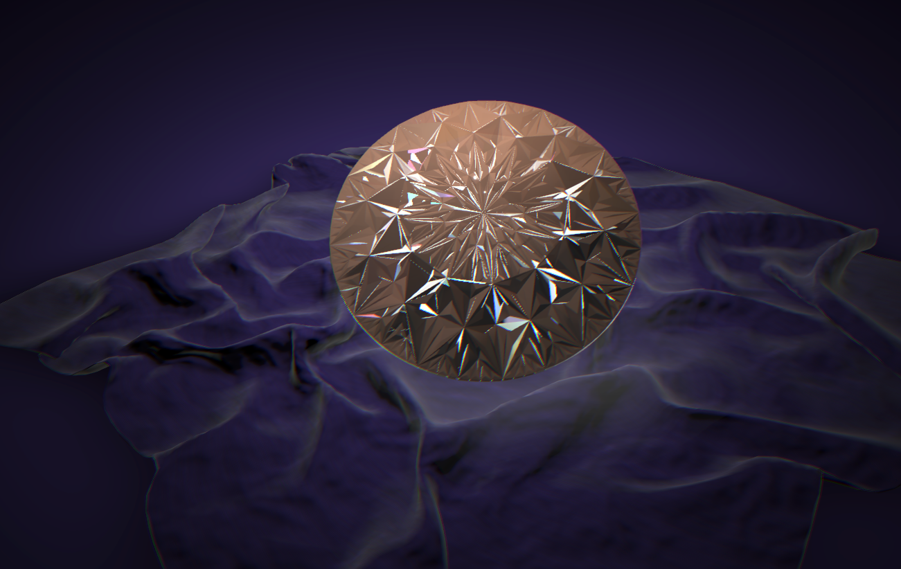

# Babylon Diamond React

[中文文档](./README_ZH.md)

A 3D diamond rendering demo built with Babylon.js and React. Realistic refraction, reflection, and light dispersion effects.



## Features

- Realistic refraction using RenderTargetTexture (RTT)
- Dual-layer rendering for authentic diamond optics
- Real-time color adjustment
- Post-processing: chromatic aberration, bloom, vignette
- Auto-rotation showcase

## Tech Stack

- React 18 + TypeScript + Vite
- Babylon.js
- pnpm

## Project Structure

```
src/
├── main.tsx
├── App.tsx
└── scene/
    ├── DiamondScene.tsx    # Main scene
    ├── setup/              # Camera & lights
    ├── materials/          # Materials & refraction
    ├── ui/                 # Color pickers
    └── postprocess/        # Effects
```

## Quick Start

```bash
pnpm install
pnpm dev
```

## Build

```bash
pnpm build
```

The dev and build commands generate the required asset manifest before Vite.
The build command also precompresses production assets.

## Loading and Verification

Source models and embedded textures remain in `public/`. The asset preparation
step preserves geometry, extracts shared textures, losslessly compresses PNG
textures where beneficial, and emits content-hashed files under
`generated/public/scene-assets/`. Generated files are not committed.
Only the required Babylon modules and first-frame WebGL shaders are imported.

Tests require Node.js 22.18+ and a Playwright browser:

```bash
npm test
npm run lint
npm run build
npx playwright install chromium
npm run preview -- --host 127.0.0.1 --port 4186
# In another terminal:
npm run test:browser
# To use installed Chrome and test production:
PLAYWRIGHT_CHANNEL=chrome DIAMOND_URL=https://diamond.moxixii.com/ npm run test:browser
```

The browser check covers desktop/mobile cold and warm loads, rendered canvas
pixels, interaction, duplicate requests, shader request counts, loading feedback,
and model/material failure states. Screenshots and timings are written to
`test-results/`. `diamond-ready` measures the first rendered frame after scene
resources and shaders are ready, excluding screenshot/interaction overhead.
Entry-script and texture failures must also retain the retry state. Setting
`SOFTWARE_WEBGL=1` uses SwiftShader and compares the desktop first frame against
the pre-optimization screenshot in `tests/fixtures/diamond-desktop.png` with a
small rendering tolerance. Drag changes must exceed idle auto-rotation changes.

Production Nginx must enable `gzip_static on` (with gzip fallback), serve hashed
`/assets/` and `/scene-assets/` with immutable caching, and revalidate `index.html`.
Deploy both asset directories including `.gz` files before atomically replacing
`index.html`. HTML uses dynamic compression so no stale `.gz` shell is retained.
Keep previous hashed files for open tabs and
rollback. The Nginx configuration is maintained in `blog/infra/k8s/apps/static-sites.yaml`.

### Measured Results (2026-09-08)

Production, fresh Chrome contexts, 1280x800, SwiftShader, same connection and
screenshot-based first-visible check before and after (three cold runs each):

| Metric | Before | After |
| --- | --- | --- |
| Median first visible scene | 18.54 s | 12.21 s |
| Resource transfer | 3.90 MB | 2.10 MB |

The separate `diamond-ready` mark measured 11.03 s on desktop and 10.09 s at
390x844 in the production smoke test. Warm loads measured 4.14-4.36 s with zero
asset transfer. These are test-environment measurements, not device-independent
latency guarantees. The older 21-28 s figure included test interaction overhead.

## How It Works

1. **Refraction**: Invisible helper sphere + RTT captures environment
2. **Layered Materials**: Inner (refraction) + Outer (reflection)
3. **NodeMaterial**: Custom shaders via JSON
4. **Post-Processing**: Chromatic aberration + bloom + vignette

## Controls

- Mouse drag: Rotate
- Scroll: Zoom
- Color pickers: Adjust diamond/environment colors
